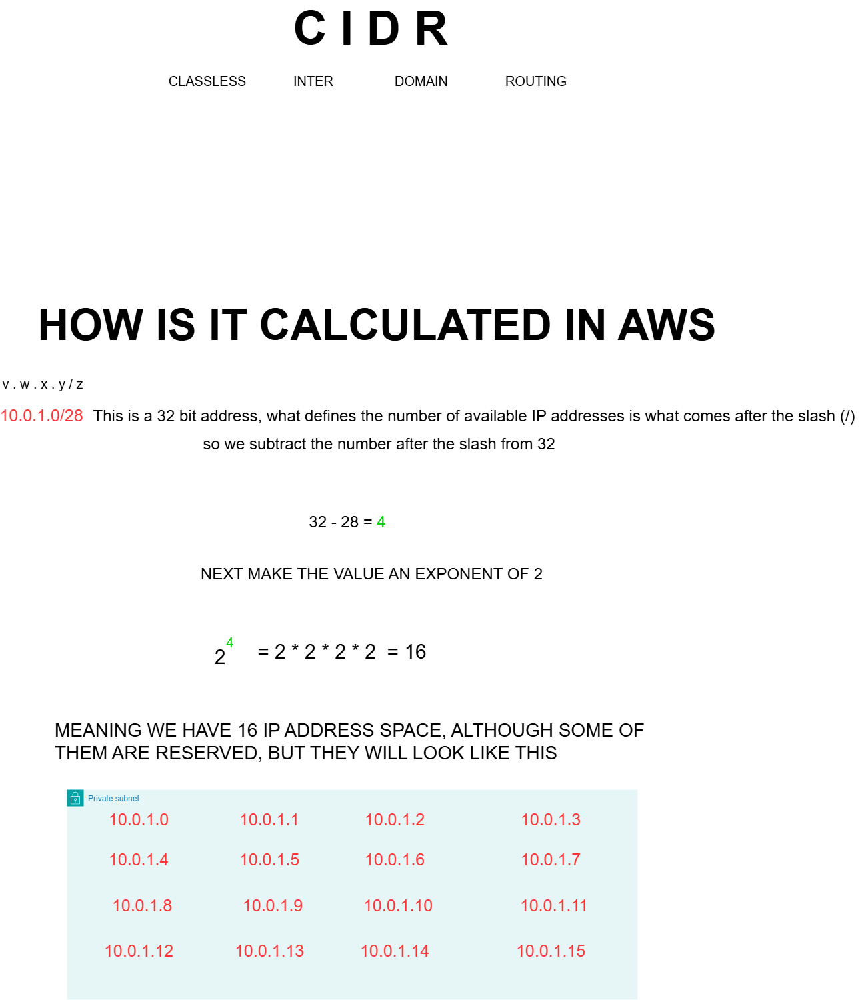

# AWS Learning - CIDR Notation

This repository contains learning materials about AWS networking concepts, specifically focusing on CIDR (Classless Inter-Domain Routing) notation.

## What is CIDR?

**CIDR** stands for **Classless Inter-Domain Routing**. It's a method for allocating IP addresses and routing Internet Protocol packets. CIDR notation is widely used in AWS for defining IP address ranges in VPCs, subnets, and security groups.

## CIDR Notation Format

CIDR notation uses the format: `v.w.x.y/z`

Where:
- `v.w.x.y` is an IP address (IPv4)
- `/z` is the CIDR suffix (a number between 0 and 32)

## How is CIDR Calculated in AWS?

The CIDR suffix determines how many IP addresses are available in the range. Here's how to calculate it:

### Example: 10.0.1.0/28

This is a 32-bit address. What defines the number of available IP addresses is the number after the slash (`/`).

**Step 1:** Subtract the CIDR suffix from 32
```
32 - 28 = 4
```

**Step 2:** Make the result an exponent of 2
```
2^4 = 2 × 2 × 2 × 2 = 16
```

This means we have **16 IP addresses** in this address space.

### IP Address Range

Although some addresses are reserved by AWS, the 16 IP addresses in the `10.0.1.0/28` range look like this:

#### 16 Addresses in Range

| IP Address | IP Address | IP Address | IP Address |
|------------|------------|------------|------------|
| 10.0.1.0   | 10.0.1.1   | 10.0.1.2   | 10.0.1.3   |
| 10.0.1.4   | 10.0.1.5   | 10.0.1.6   | 10.0.1.7   |
| 10.0.1.8   | 10.0.1.9   | 10.0.1.10  | 10.0.1.11  |
| 10.0.1.12  | 10.0.1.13  | 10.0.1.14  | 10.0.1.15  |

## Common CIDR Blocks

Here are some common CIDR blocks and their total IP address counts:

| CIDR Block | Total IPs | Calculation |
|------------|---------------|-------------|
| /32        | 1             | 2^(32-32) = 2^0 = 1 |
| /28        | 16            | 2^(32-28) = 2^4 = 16 |
| /24        | 256           | 2^(32-24) = 2^8 = 256 |
| /16        | 65,536        | 2^(32-16) = 2^16 = 65,536 |
| /8         | 16,777,216    | 2^(32-8) = 2^24 = 16,777,216 |

## AWS Reserved IP Addresses

Important to note: AWS reserves 5 IP addresses in each subnet CIDR block:
- **First IP**: Network address
- **Second IP**: VPC router
- **Third IP**: DNS server
- **Fourth IP**: Reserved for future use
- **Last IP**: Broadcast address

So for a /28 CIDR block with 16 total IPs, only **11 are usable** for EC2 instances and other resources.

> **Note**: The "Total IPs" column in the table above shows the total number of IP addresses in each CIDR block. When used as an AWS subnet, subtract 5 from this number to get the usable IP addresses.

## Resources



## License

This is a learning repository for AWS networking concepts.
